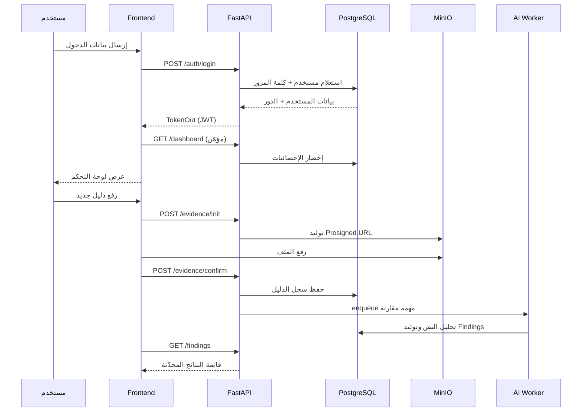

# تقرير تشغيل وتكامل منصة **AuditOrbit**

## 1. مقدمة مرجعية

- تمت مراجعة المنصة بصفتي مدير تدقيق داخلي بخبرة تتجاوز عشر سنوات، مع التركيز على التحقق من سلامة دورة العمل ومواءمة المكونات التقنية مع متطلبات الحوكمة والرقابة.
- نطاق الدراسة شمل واجهات الويب (`frontend`)، واجهات البرمجة (`api`)، منظومة معالجة الذكاء الاصطناعي (`ai/worker`) والبنية التحتية الداعمة (`infra`).
- الهدف توثيق خطوات التشغيل خطوة بخطوة، تحديد وظيفة كل عنصر، وتوضيح الترابط الزمني والوظيفي بين المراحل.

## 2. ملخص تنفيذي للملاحظات الرئيسية

- تدفق المصادقة يعتمد على طبقة `frontend/middleware.ts` مع تكامل مباشر لخدمة `api/presentation/routers/auth.py`؛ أي خلل في التوكن يعيد المستخدم تلقائيًا إلى `/login`.
- لوحة التحكم الرئيسية تعتمد على جلب بيانات مباشرة من `dashboardApi` في `frontend/app/dashboard/page.tsx`، ما يستوجب جاهزية نقاط النهاية `/dashboard` و`/engagements` في الـ API.
- المهام التدقيقية (Engagements) مربوطة بجدول `engagements` وفق ترحيل `api/alembic/versions/0003_planning_engagements.py`؛ لا يمكن إنشاء مهام دون توفر سجل للخطة السنوية.
- معالجة الأدلة تعتمد على تخزين MinIO عبر `api/infrastructure/storage/s3.py` مع تكامل إلى مهمة ذكاء اصطناعي في `ai/worker/compare.py` عند تشغيل مهام المقارنة.
- البنية التحتية في `infra/docker-compose.yml` تشكل الأساس؛ توقف أي خدمة (Postgres، Redis، MinIO، API، AI) يوقف السلسلة بالكامل.

## 3. مخطط معماري عالي المستوى

```mermaid
flowchart TD
  User[مستخدم الواجهة] -->|HTTPs + JWT| Frontend[Next.js Frontend]
  Frontend -->|REST /auth /dashboard /engagements| API[FastAPI Backend]
  API -->|SQLAlchemy| DB[(PostgreSQL)]
  API -->|S3 Signed URLs| MinIO[(Object Storage)]
  API -->|Redis Queue| AIWorker[AI Worker (RQ)]
  AIWorker -->|تحليل الأدلة| DB
  DevOps[Docker Compose] --> Frontend
  DevOps --> API
  DevOps --> DB
  DevOps --> MinIO
  DevOps --> AIWorker
```

## 4. دورة العمل التشغيلية التفصيلية (خطوة بخطوة)

| الترتيب | الخطوة | المكونات المعنية | الأدلة والتحقق |
|---------|--------|------------------|----------------|
| 1 | **تهيئة البيئة** | ملفات `infra/docker-compose.yml`, إعداد المتغيرات `.env` | تشغيل الخدمات يهيئ Postgres, Redis, MinIO, API, AI |
| 2 | **ترحيل قاعدة البيانات** | سكربتات `api/alembic/versions` | أمر `alembic upgrade head` ينشئ الجداول الأساسية مثل `users`, `roles`, `engagements` |
| 3 | **إعداد بيانات المستخدمين** | `api/scripts/create_user.py` أو استعلام SQL مباشر | ضمان وجود مستخدمين على الأقل لكل دور قبل الفتح |
| 4 | **بدء الواجهة الأمامية** | `frontend/app/login/page.tsx`, `frontend/middleware.ts` | واجهة الدخول تلتقط البريد وكلمة المرور وترسل POST إلى `/auth/login` |
| 5 | **تحقق المصادقة وإصدار التوكن** | `api/presentation/routers/auth.py`, `api/infrastructure/security/jwt.py` | التوكن يعاد في هيئة `TokenOut` ويخزن عبر `TokenManager` في المتصفح |
| 6 | **توجيه المستخدم حسب الدور** | `frontend/middleware.ts`, `frontend/lib/auth-context.ts` | بعد فك التوكن يتم توجيه Admin→`/admin`, Manager→`/manager`, Auditor→`/auditor` |
| 7 | **عرض لوحة التحكم** | `frontend/app/dashboard/page.tsx`, `dashboardApi` | يجلب إحصائيات من `/dashboard`، `/engagements`, `/reports`, `/notifications` |
| 8 | **إدارة المهام التدقيقية** | `frontend/components/engagements-section.tsx`, `api/presentation/routers/engagements.py` | استعلام GET يعيد `PageOut`، إنشاء مهمة يقوم بإدراج سجل في `engagements` |
| 9 | **تحميل الأدلة وربطها بالمهام** | `frontend/components/evidence-section.tsx`, `api/presentation/routers/evidence.py`, MinIO | init/upload يولد توقيع رفع، confirm يربط الدليل ويخزن المفتاح |
|10 | **تشغيل مقارنة الذكاء الاصطناعي** | `api/presentation/routers/compare.py`, `ai/worker/compare_task.py`, `ai/worker/compare.py` | يتم دفع المهمة إلى Redis Queue `ai-tasks` وتشغيل Worker لتحليل النص وتوليد Findings |
|11 | **معالجة النتائج والتقارير** | `frontend/components/findings-section.tsx`, `frontend/components/reports-section.tsx`, جداول `findings`, `reports` | يتم عرض النتائج المفتوحة، وتحديث حالتها عبر API |
|12 | **إدارة المستخدمين والصلاحيات** | `frontend/app/admin/page.tsx`, `api/presentation/routers/users.py`, جدول `roles` | واجهة الإدارة تعرض المستخدمين وتسمح بتعديل الأدوار، مع الانتباه أن RBAC الحالي يسمح بكل العمليات (TODO في `rbac.py`). |


## 5. وظائف عناصر الواجهة الأمامية (من الأعلى إلى الأسفل)

| المسار في الواجهة | الوصف الوظيفي | واجهات API الداعمة | بيانات داعمة |
|-------------------|----------------|--------------------|---------------|
| `/login` (`frontend/app/login/page.tsx`) | استقبال الاعتمادات أو استخدام أزرار Mock للأدوار المختلفة | `POST /auth/login` | جدول `users`, عملية التحقق `verify_password` |
| `/dashboard` (`frontend/app/dashboard/page.tsx`) | لوحة موحدة تعرض KPIs ومقاييس التقدم ومهام حديثة | `/dashboard`, `/engagements`, `/reports`, `/notifications` | جداول `engagements`, `findings`, `reports` |
| `/admin` (`frontend/app/admin/page.tsx`) | مركز تحكم للأدوار، المستخدمين، السجلات | `/users`, `/roles`, `/audit/logs`, `/reports` | جداول `users`, `roles`, `audit_logs` |
| `/manager` (`frontend/app/manager/...`) | إدارة الخطط السنوية، تكليف الفرق، متابعة التقدم | `/engagements`, `/checklists`, `/reports` | جداول `annual_plans`, `engagement_assignments` |
| `/auditor` (`frontend/app/auditor/...`) | مساحات تنفيذ المدقق، قوائم التحقق، أرشيف الأدلة | `/checklists`, `/evidence`, `/findings` | جداول `checklists`, `evidence`, `findings` |
| `/ops` (`frontend/app/ops/page.tsx`) | مراقبة صحة المنصة، عرض المقاييس للحسابات ذات الصلاحية | `/ops/health`, `/ops/metrics` | صحة الخدمات (DB, Redis, MinIO) |


## 6. منظومة الواجهة الخلفية (FastAPI)

- **نقطة الدخول**: `api/presentation/main.py` تنشئ تطبيق FastAPI، تضيف CORS، وتدمج الراوترات.
- **الميدل وير**: تم تعليق `SecurityHeadersMiddleware` و`SlowAPIMiddleware` مؤقتًا لأغراض التصحيح؛ يجب إعادة تفعيلها في الإنتاج.
- **المصادقة**:
  - `POST /auth/login`: يستخدم استعلام SQL يدوي للتحقق من المستخدم (`api/presentation/routers/auth.py`).
  - التوكنات تنشأ عبر `api/infrastructure/security/jwt.py`.
- **إدارة المهام**: `api/presentation/routers/engagements.py` يوفر عمليات القراءة والإنشاء مع فرض RBAC (حاليًا يسمح للجميع بسبب TODO في `rbac.py`).
- **الأدلة**: `api/presentation/routers/evidence.py` يوقع روابط S3 ويخزن البيانات في جدول `evidence` ويؤكد عبر `EvidenceConfirmIn`.
- **التنبيهات والتقارير**: راوترات `notifications.py`, `reports.py`, `dashboard.py` تلجأ إلى استعلامات SQL لتجميع البيانات.
- **الطبقة التطبيقية**: DTOs في `api/application/dtos` تضمن نماذج الإدخال/الإخراج؛ الخدمات في `api/application/services` تدير منطق الأعمال.
- **المستودعات**: بعد الإصدار 0.2.0 تم الميل لاستخدام SQL نصي مباشر لتعجيل التطوير، وهو ما يتطلب ضوابط تدقيق إضافية على الاستعلامات لتقليل مخاطر حقن SQL.

## 7. خط معالجة الذكاء الاصطناعي والمهام الخلفية

- **دور Redis**: يعمل كوسيط رسائل للمهمة `ai/worker/compare_task.py` التي تستهلكها Worker يعتمد على RQ (`ai/worker/run.py`).
- **المهمة الأساسية**: `compare_and_store` في `ai/worker/compare.py` يقوم بالخطوات التالية:
  1. يسحب آخر استخراج لنص الدليل من جدول `evidence_extractions`.
  2. يجلب قواعد السيناريو من جدول `comparison_scenarios`.
  3. يطبق قواعد `any/all` ويولد Findings في جدول `findings` مع تفاصيل JSON.
- **اعتمادية العمل**: العملية تفترض توفر بيانات استخراج مسبقة؛ غيابها يعيد `{ok: False, error: "no_extraction"}`، وهو ما يجب مراقبته عبر سجلات Worker.

## 8. تسلسل البيانات بين الخطوات (نظرة تدفق)



## 9. مصفوفة الاعتماد الزمني بين الخطوات

1. **تهيئة البنية التحتية** شرط أساسي قبل أي خطوة أخرى.
2. **ترحيل قاعدة البيانات** يجب أن يسبق إنشاء المستخدمين؛ عدم وجود الجداول يمنع المصادقة.
3. **إنشاء المستخدمين والأدوار** شرط لتجربة صلاحيات الواجهة؛ بدونه سيُرفض الدخول.
4. **تشغيل الواجهة الأمامية** يعتمد على أن واجهة الـ API متاحة وتستجيب خلال 200ms (مقترح رقابي).
5. **تحميل الأدلة** يتطلب نجاح خطوات المصادقة + تهيئة MinIO + وجود ارتباط لمهمة تدقيقية.
6. **تشغيل مهام الذكاء الاصطناعي** مرتبط بوجود Redis وتشغيل Worker؛ توقف أي منهما يمنع إنشاء Findings ويعطي نتائج ناقصة في لوحة المدقق.
7. **تقارير الاسترجاع** تعتمد على تراكم البيانات في `findings`, `reports`; غياب أي خطوة سابقة سيظهر فجوات رقمية في لوحة الإدارة.

## 10. عينات كود داعمة (للتدقيق التقني)

### 10.1 ميدل وير حماية الواجهة (`frontend/middleware.ts`)

```typescript
function decodeToken(token: string): DecodedToken | null {
  const parts = token.split('.')
  if (parts.length !== 3) return null
  const payload = JSON.parse(Buffer.from(parts[1], 'base64').toString('utf-8'))
  if (payload.exp && payload.exp * 1000 < Date.now()) {
    return null
  }
  return payload as DecodedToken
}
```

> التدقيق: الاعتماد على `Buffer` في المتصفح يعمل لأن Next.js يستخدم بيئة Node أثناء المعالجة؛ يوصى بالتحقق من التوافق مع متصفحات الإنتاج.

### 10.2 إدراج مهمة تدقيقية جديدة (`api/presentation/routers/engagements.py`)

```python
created = db.execute(
  text('''
    INSERT INTO engagements(
      id, annual_plan_id, title, scope, risk_rating,
      start_date, end_date, status, created_at
    ) VALUES (
      :id, :plan_id, :title, :scope, 'medium',
      CURRENT_DATE, CURRENT_DATE + INTERVAL '30 days', 'planned', CURRENT_TIMESTAMP
    )
    RETURNING ...
  '''),
  {...}
).mappings().first()
```

> التدقيق: الاعتماد على إنشاء خطة سنوية تلقائيًا إذا غابت (`Annual Plan`) يضمن عدم فشل العملية، لكن يجب توثيقها في دليل الإجراءات لتفادي تكرار خطط بلا محتوى.

## 11. مخاطر تدقيقية وتوصيات

- **تراخي ضوابط RBAC**: الدالة `has_permission` في `api/infrastructure/security/rbac.py` تعيد `True` دائمًا؛ يجب إعادة تفعيل فحص الجداول `permissions` و`role_permissions` قبل الانتقال للإنتاج.
- **تعطيل الطبقات الأمنية**: تم تعطيل `SecurityHeadersMiddleware` و`SlowAPIMiddleware`؛ يُوصى بإعادة تفعيلهما مع ضبط حدود الطلبات لحماية API من هجمات الحرمان من الخدمة.
- **حفظ التوكن في LocalStorage**: `TokenManager` يخزن JWT في `localStorage` مع Cookie للميدل وير؛ يوصى باستخدام Cookies آمنة (HttpOnly) لتقليل مخاطر XSS.
- **التعامل مع استثناءات Worker**: غياب آلية إعادة المحاولة في `ai/worker/run.py` قد يؤدي لضياع مهام عند فشل مؤقت؛ يُوصى بتفعيل `with_scheduler=True` أو آلية retry منفصلة.
- **سجلات المراجعة**: واجهة `/admin` تعرض سجلات تدقيق، لكن عدم وجود إدراج فعلي في جدول `audit_logs` ضمن نقاط النهاية الرئيسية يقلل من جدوى السجل؛ يجب إضافة Middleware لتسجيل العمليات الحساسة.
- **مراقبة تكامل MinIO**: أي خطأ في رفع الأدلة يعيد للمستخدم Presigned URL دون تحقق لاحق؛ يوصى ببناء مهمة دورية للتحقق من وجود الكائن في التخزين بعد التأكيد.

## 12. توصيات ختامية وخطوات قادمة

- استكمال تعريف الصلاحيات في `permissions` وربطها بواجهات الإدارة قبل تشغيل النظام فعليًا.
- إعداد خطة اختبارات تكامل (Integration Tests) شاملة لتدفق الأدلة والذكاء الاصطناعي عبر `api/tests` و`ai/tests`.
- توثيق إجراءات الطوارئ: تشمل سيناريوهات انقطاع Redis أو MinIO، مع إرشادات استعادة الخدمة.
- تحديث هذا التقرير دوريًا بعد كل تغيير جوهري في البنية لضمان توافقه مع الواقع التشغيلي.

> **خاتمة**: المنصة مترابطة بشكل قوي؛ أي خلل في خطوة من الخطوات السابقة يؤدي إلى فجوة واضحة في التقارير ولوحة التحكم. الالتزام بالترتيب الزمني الموثق وتفعيل الضوابط المقترحة سيمكن فريق التدقيق من الاعتماد على المنصة بثقة.

